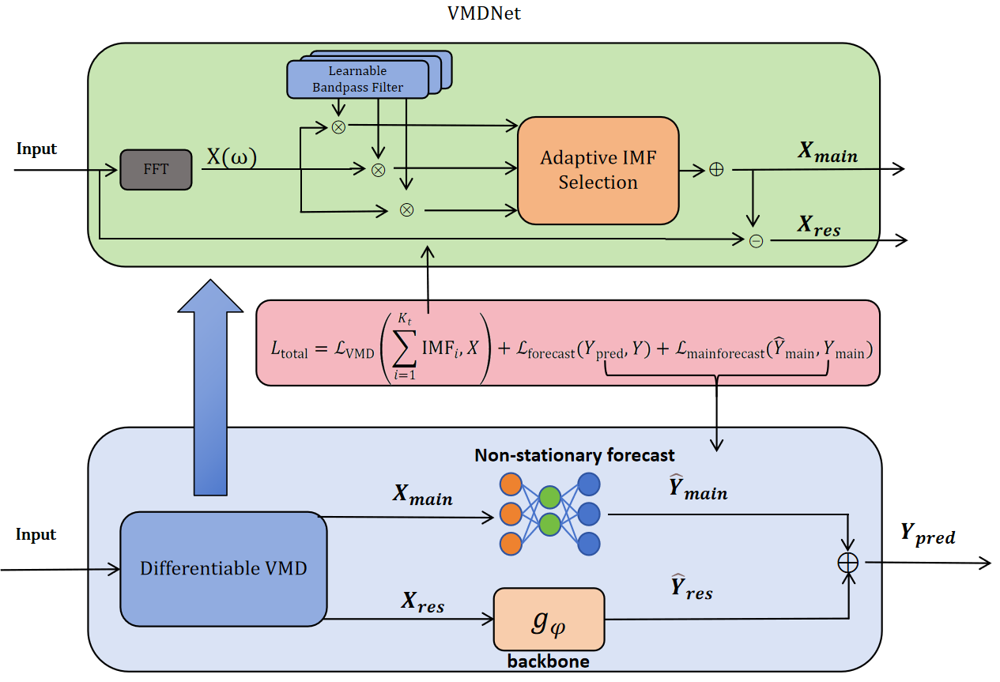

# VMDNet

# 1 Learnable Variational Mode Decomposition for Non-stationary Time Series Forecasting

This is the offcial repository of paper "Learnable Variational Mode Decomposition for Non-stationary Time Series Forecasting"




# 2 Datasets

ETTh1, ETTh2, ETTm1, ETTm2, ExchangeRate, Weather, Electricity Trafficwill be downloaded automatically which has been written in code.

# 3 Run baseline&VMDNet

## 3.1 install requirements

1. to run our code, **Please make sure your python version is >=3.8.**
2. install all the requirements, we assume that you have installed torch according to your environment
```
pip install -r ./requirements.txt
```

3. please manually add this directory to your PATHONPATH environment variable

```
export PYTHONPATH=./
```

## 3.2 run baseline&VMDNet
### 1. VMDNet

Please change the settings in the following for what you need.
```python
# running VMDNet using DLinear backbone with output length 96, 168, 336, 720 on all datasets with input window 96
nohup bash scripts/run_vmd_wandb.sh "VMD_DLinear" "No" "Electricity ETTh1 ETTh2 ETTm1 ETTm2 ExchangeRate Traffic Weather" "96 168 336 720" "cuda:1" 96 "{norm_sep_loss:True}" > vmd_dlinear.log 2>&1 &
```
### 2. baselines
Please change the settings in the following for what you need.
```python
# running Dlinear baseline with output length 96, 168, 336, 720 on dataset ETTh1 ETTh2 ETTm1 ETTm2 with input window 96
nohup bash scripts/run_wandb.sh "DLinear" "No" "ETTh1 ETTh2 ETTm1 ETTm2" "96 168 336 720" "cuda:1" 96 > dlinear.log 2>&1 &
```
